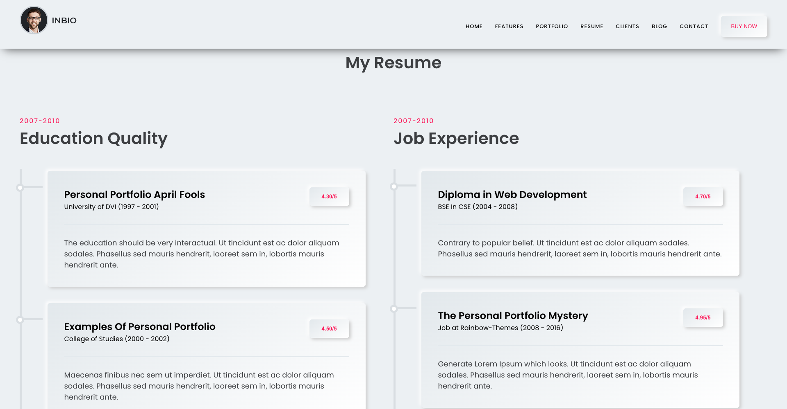

# My first Portfolio project in Reactjs

This project was developed as a practice project before developing my main Portfolio.

And is also one of my first projects written in Reactjs as I was an Angular developer prior to this.

Project is followed through this [tutorial on youtube](https://www.youtube.com/watch?v=_tUNvxA9UV4&ab_channel=GorkCoder).

## Screenshots for easy view of the project

# Home section

# Features section

# Portfolio section

# Resume section

# Client section

# Blog section

# Contact section

## Conclusion

It was a fairly simple project which only took me a day or two to complete it.
From the project, I've learned how to create react components and embed them into other components.
Basic react syntaxes and some of the react hooks were used.